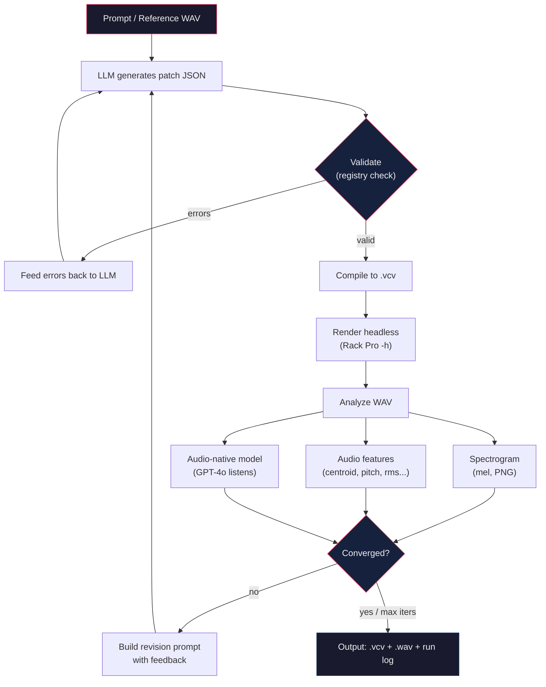
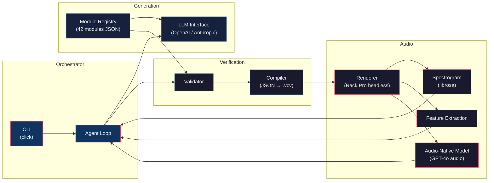
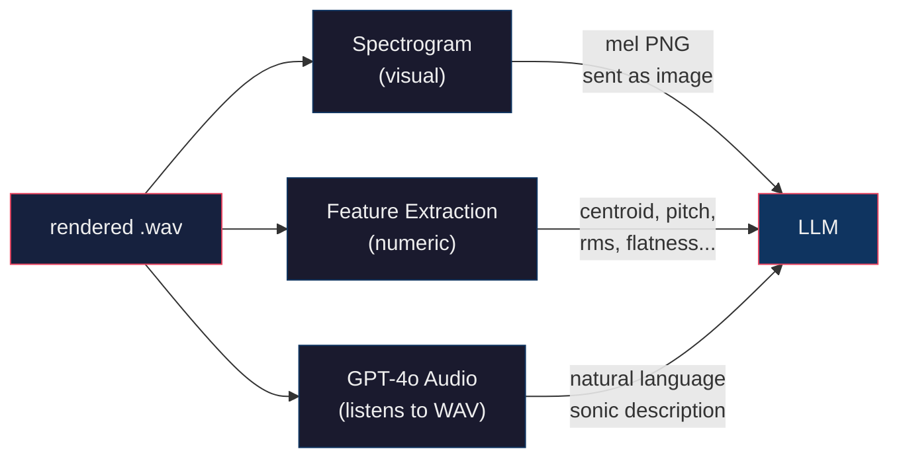
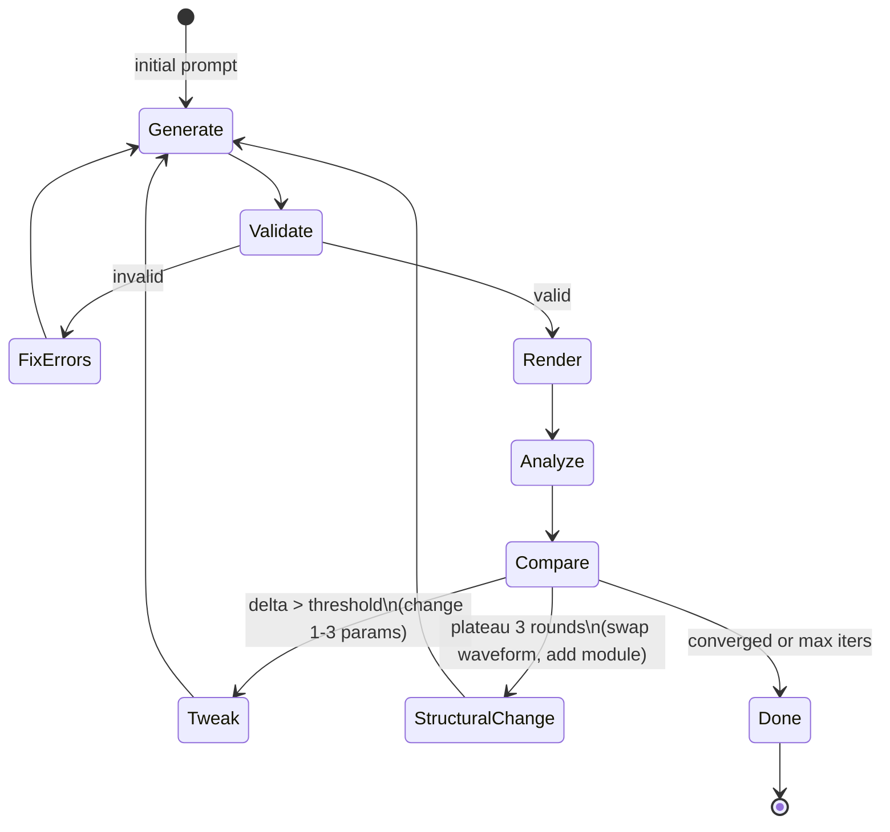

# vcv-agent

LLM-in-the-loop sound design agent for VCV Rack Pro.

Describe a sound (or provide a reference WAV), and the agent iteratively generates,
renders, analyzes, and refines VCV Rack patches until the output converges on the target.

## How it works



## Architecture



## Feedback channels

The agent "hears" through three complementary channels:



## Iteration strategy



## Requirements

- Python 3.11+
- VCV Rack 2 Pro (headless mode)
- OpenAI API key (GPT-4o for generation + audio feedback)
- librosa, matplotlib, pyzstd (installed via pip)

## Quick start

```bash
git clone https://github.com/thisIsDanielJin/vcv-agent.git
cd vcv-agent
python -m venv .venv && source .venv/bin/activate
pip install -e .
cp .env.example .env  # add your OPENAI_API_KEY

# text prompt mode
vcv-agent "short percussive acid bleep, A3, resonant filter sweep, 50ms decay"

# reference audio mode
vcv-agent --reference path/to/target.wav

# validate a patch without rendering
vcv-agent --validate-only --patch-json path/to/patch.json
```

## Project structure

```
vcv-agent/
  vcv_agent/
    cli.py             # entry point
    orchestrator.py    # agent loop (generate-validate-render-analyze-revise)
    llm.py             # LLM interface (OpenAI, GPT-4o audio)
    validator.py       # structural patch validation against registry
    compiler.py        # patch JSON -> .vcv file (tar+zstd)
    renderer.py        # VCV Rack Pro headless rendering
    analyzer.py        # spectrogram + audio feature extraction
    config.py          # settings from .env
  registry/
    modules.json       # 42 modules: params, ports, ranges
  docs/
    architecture.md    # full design doc
  test/                # pytest suite
  scripts/
    build_registry.py  # regenerate registry from source data
```

## Module scope (v1)

38 Fundamental modules + 3 Core modules. No third-party plugins.
The full registry with every parameter ID, port ID, and valid range
lives in `registry/modules.json`.

## Status

Pre-alpha. Core pipeline built, not yet battle-tested end-to-end.

## License

MIT
